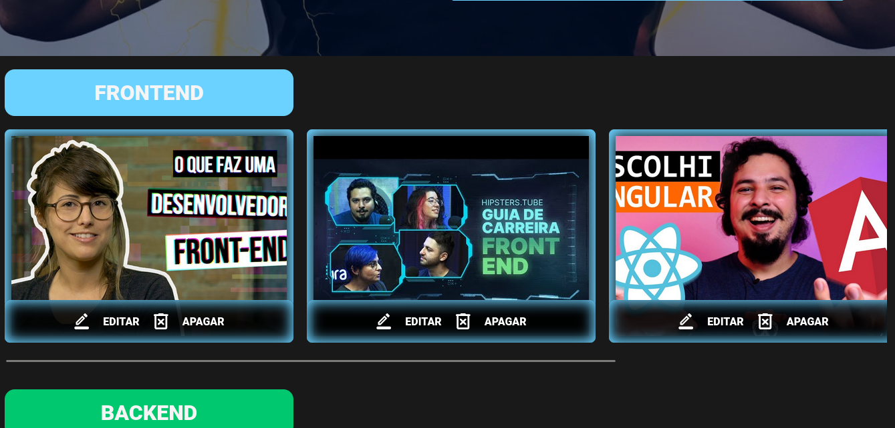
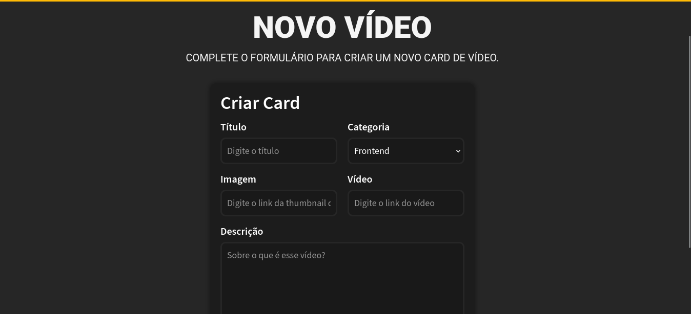
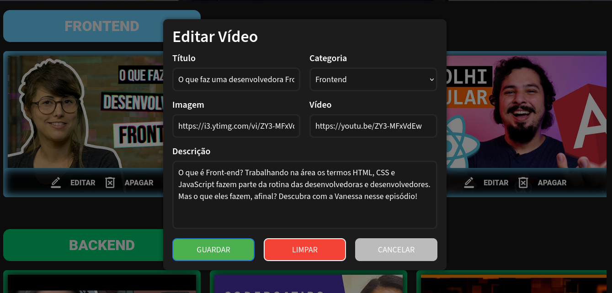
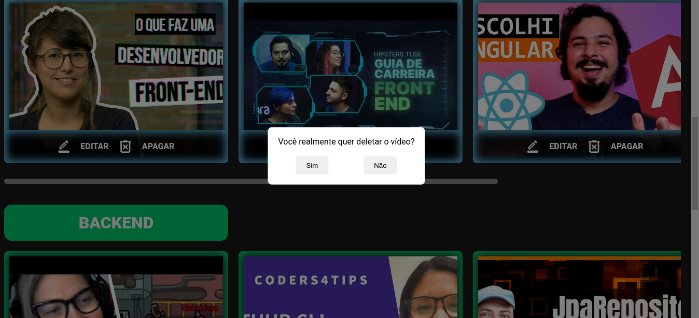

# AluraFlix

AluraFlix é uma aplicação simples para criar e gerenciar cards de vídeos.

## Funcionalidades Principais

### Criação de Cards de Vídeos

Para criar um novo card de vídeo, preencha o formulário com os detalhes necessários, incluindo título, categoria, URL da imagem, URL do vídeo e descrição.

### Edição de Cards de Vídeos

É possível editar um card existente clicando no botão de edição. Isso abrirá um modal onde você pode atualizar os detalhes do vídeo.

### Exclusão de Cards de Vídeos

Para remover um card, basta clicar no ícone da lixeira. Confirme a exclusão quando solicitado para remover o vídeo da lista.

## Como Usar

### Instalação

1. Clone o repositório.
2. Instale as dependências com `npm install`.

### Configuração

1. Certifique-se de que o backend do AluraFlix esteja configurado corretamente.
2. Configure a URL do backend em `services/VideoService.js`.

### Execução

- Inicie o servidor de desenvolvimento com `npm start`.

## Uso

- Acesse a aplicação no navegador e comece a criar, editar e excluir cards de vídeos.

## Tecnologias Utilizadas

- React.js
- CSS
- Axios

## Estrutura de Arquivos

- `components/`: Componentes React utilizados na aplicação.
- `services/`: Serviços para integração com o backend e gerenciamento de dados.
- `docs/`: Imagens utilizadas neste README.

## Contribuição

Contribuições são bem-vindas! Sinta-se à vontade para abrir uma issue ou enviar um pull request com melhorias.
